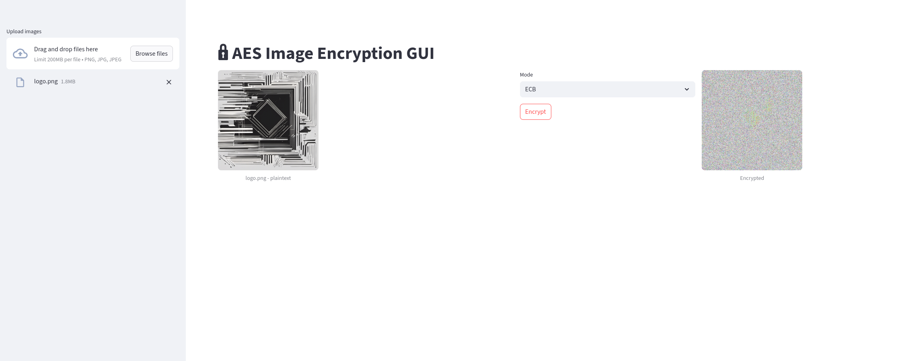

# RNG & ENTROPY


This repository is kind of a test laboratory for randdom number generation and entropy. I'm testing several algorithm and technics for fun.

**Disclaimer: None of the cryptography in this repository is meant to be used for real-life purposes; it is only intended for educational and testing purposes.**

# Installation

1- Clone the repository
```py
git clone https://github.com/Bl4omArchie/RNG-AND-ENTROPY
```

2- Create and activate a python env
```bash
python3 -m venv rng
source rng/bin/activate 
```

3- Install dependencies : 
```bash
pip3 install -r requirements.txt
```


# Features

- camera_byte_stream : use your camera to gather pixels and use shot noise to create random numbers

- aes_picture_encrypt : encrypt and decrypt pictures using AES. New : streamlit dashboard for encrypting and decrypting a file



Use this command to launch the dashboard :
```bash
streamlit run aes_picture_encrypt.py 
```

- entropy_calculator : compute the entropy of a given file
